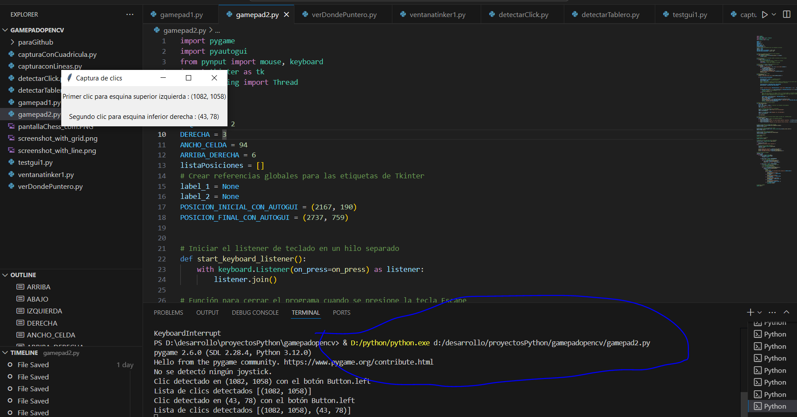
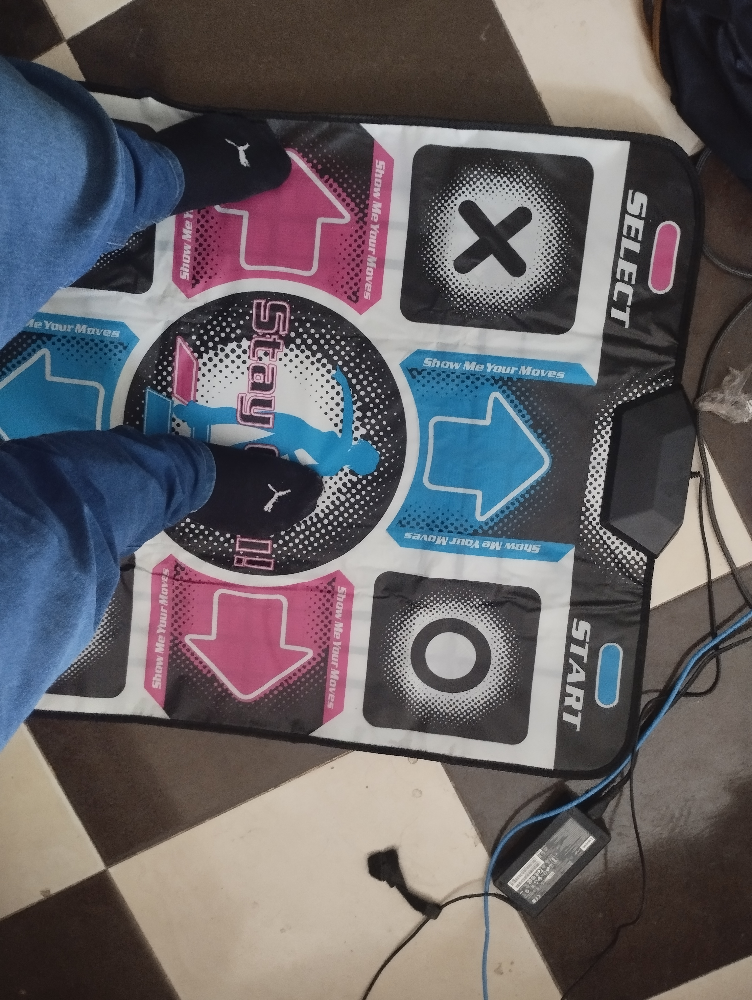

# play-chess-with-feet
play chess with feet with un a dance pad

while making adjustments so that it can be used by someone who is not a developer, the steps to use what has been done are to first run gamepad2.py with python

mientras se hace ajustes para q lo pueda usar alguien q no sea desarrollador los pasos para usar lo que se ha hecho son primer ejecutar gamepad2.py con python

[/0.jpg)]([https://www.youtube.com/watch?v=dQw4w9WgXcQ](https://youtu.be/rc8lx1QNrlw))

[Mira este video en YouTube](https://www.youtube.com/watch?v=dQw4w9WgXcQ)

o con miniatura:

